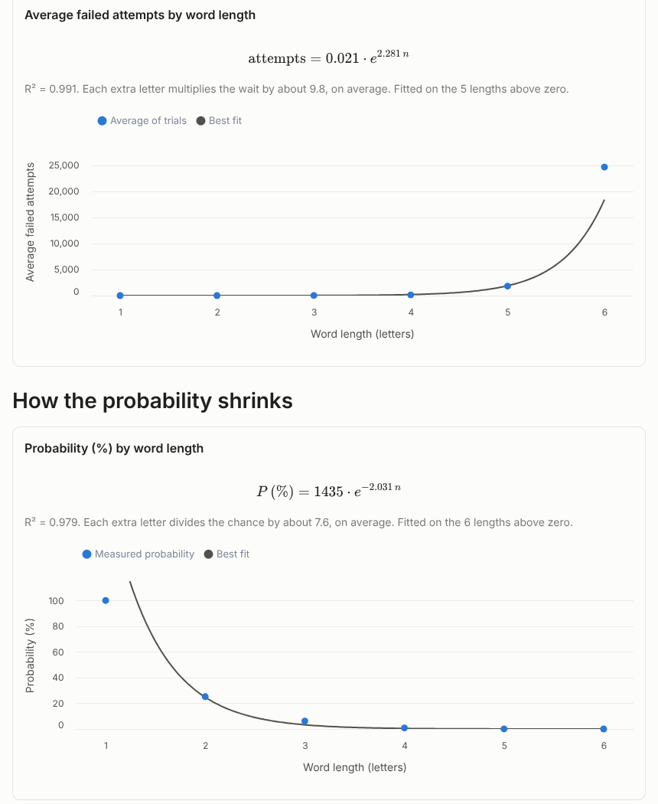

# Infinite Monkey Theorem - An Exploration

An interactive Streamlit experiment on a variation of the Infinite Monkey Theorem. It keeps drawing random strings of letters until one is a real English word from a dictionary. It counts the failed attempts, and shows how the number of attempts to find a valid word grows as words get longer.

## What it does

For each word length you choose, the app runs many trials of the same experiment:

1. Build a random string of that length, with every letter equally likely.
2. If the string is a dictionary word, the trial ends. If not, it counts as one failed attempt and the app draws again.
3. If a trial reaches the give-up limit, it stops and records the limit.

From those trials it reports:

- **Average failed attempts by length**, with an exponential fit, y = a·e^(bn).
- **Probability that a random string is a word**: words found ÷ strings drawn, with a 95% Wilson interval. It also gets an exponential fit.
- **A log-scale view** of the probability, with a quadratic fit in log space that captures the curve's bend.

The page explains each step, each parameter and each fit in plain language. Results for a sample run are shown below:



## Run it

```bash
pip install -r requirements.txt
streamlit run app.py
```

The first run downloads the dictionary, about 16 MB, into `data/`. Later runs reuse that copy.

## Data

Word lists come from [English-Dictionary-Open-Source](https://github.com/CloudBytes-Academy/English-Dictionary-Open-Source):

- **Modern (v2)**, the default: the 1913 Webster's Unabridged Dictionary (public domain, via Project Gutenberg and OPTED) combined with [Open English WordNet](https://github.com/globalwordnet/english-wordnet), licensed CC BY 4.0. Its full attribution is downloaded with the data as `data/LICENSE-DATA.md`.
- **1913 Webster's (v1)**: the Webster's entries on their own.

Only plain a–z entries are used. Capitalised entries such as names and abbreviations are optional.
